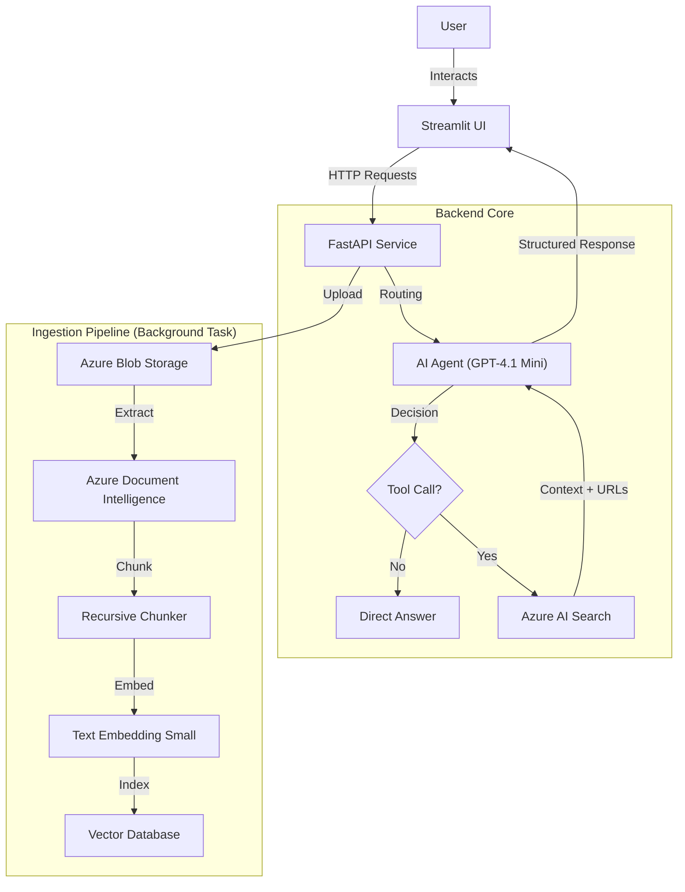

***

# 📄 Azure AI Agent with RAG & Tool Calling

AI Agent designed to answer questions about internal company policies and technical documentation. The solution utilizes a Microservice architecture, decoupling the **FastAPI** backend logic from the **Streamlit** user interface, orchestrated via **Azure OpenAI** and **Azure AI Search**.

## 🚀 Live Demo
**Chat App:** [`Streamlit App`](https://azure-ai-agent-pdf.streamlit.app)
**FastAPI endpoint:** [`FastAPI`](https://fastapi-rg.azurewebsites.net/)
---

## 🏗️ Architecture Overview

The system follows a Retrieval-Augmented Generation (RAG) pattern with intelligent tool calling.



---

## 🛠️ Tech Stack

**Core Components:**
*   **Language:** Python 3.10+
*   **Frameworks:** FastAPI, Streamlit
*   **Models:** GPT-4.1 Mini, text-embedding-small (1536 dims)

**Azure Services:**
*   **Azure OpenAI:** LLM orchestration and vector embedding generation.
*   **Azure AI Search:** Vector store for semantic retrieval.
*   **Azure Document Intelligence:** High-fidelity PDF extraction.
*   **Azure Blob Storage:** Persistent file storage.
*   **Azure App Service:** Containerized hosting.
*   **Application Insights:** Monitoring and logging.

**Key Libraries:**
*   `fastapi`, `uvicorn`, `python-multipart`: API Server
*   `streamlit`: Frontend Interface
*   `azure-ai-documentintelligence`, `azure-storage-blob`, `azure-search-documents`: Azure SDKs
*   `chonkie`: Recursive semantic chunking
*   `openai`: LLM API and Agent Logic
*   `pydantic`, `python-dotenv`: Configuration and Validation
*   `Werkzeug`: File naming utilities

---

## ✅ Implementation Features

The project fulfills the assignment requirements with several architectural enhancements:

| Component | Details |
| :--- | :--- |
| **AI Agent** | Implements `search_knowledge_base` tool. Intelligently routes queries between general chat and RAG. |
| **RAG Pipeline** | Full ETL pipeline: PDF Upload -> Doc Intel Extraction -> Embedding -> Search Indexing. |
| **Backend API** | Robust FastAPI service with endpoints for `/ask`, `/upload`, and `/files`. |
| **Deployment** | Live on Azure App Service via Docker Containers. |
| **CI/CD** | **GitHub Actions** workflow integrated for automated Docker builds and deployment. |
| **User Interface** | **Streamlit** frontend allows for file uploads, progress tracking, and chat simulation. |
| **Storage** | Integrated **Azure Blob Storage** for persistent document management. |
| **Monitoring** | Integrated **Azure Application Insights** for performance tracking. |

---

## ⚙️ Setup Instructions

### Prerequisites
*   Python 3.10+
*   Azure Subscription with required resources deployed.

### 1. Clone & Install
```bash
git clone https://github.com/CaptainHippie/Azure-AI-Agent.git
cd Azure-AI-Agent
pip install -r requirements.txt
```

### 2. Configuration
Create a `.env` file in the root directory with the same structure given in `.env.example`:

### 3. Run Locally
**Terminal 1 (Backend):**
```bash
uvicorn app.main:app --reload
```

**Terminal 2 (Frontend):**
```bash
streamlit run streamlit_app.py
```

---

## 🚀 Deployment & CI/CD

The application is containerized using Docker and deployed to **Azure App Service**.

**Automated Workflow:**
This repository utilizes **GitHub Actions** for Continuous Deployment.
1.  **Trigger:** Pushing code to the `main` branch.
2.  **Build:** The action builds the Docker image.
3.  **Push:** The image is pushed to the Azure Container Registry (ACR).
4.  **Deploy:** The Azure App Service is updated with the new image tag.

*Note: Currently, a manual restart of the App Service in the Azure Portal is required to pull the latest image immediately after the pipeline finishes.*

---

## 🧠 Design Decisions

### 1. Enhanced API Response (Perplexity Style)
The API response format was modified from a simple string list to a structured dictionary. This enables the frontend to display **clickable citations** and specific context chunks used to generate the answer.
*   **Format:** `{"answer": "...", "source": {"doc_name": {"url": "...", "context": [...]}}}`

### 2. Indexing Performance
**Azure Document Intelligence** was chosen over local libraries (like PyMuPDF) to ensure high-fidelity extraction of tables and headers. Despite using a cloud service, the pipeline is optimized. With a configured limit of 50 pages per PDF, typical indexing times are highly efficient:
*   **10 Page PDF:** ~20-30 seconds.
*   **50 Page PDF:** < 2 minutes.

### 3. Background Processing
To ensure a responsive UI, the `/upload` endpoint offloads the heavy ingestion process (Extraction -> Embedding -> Indexing) to a FastAPI `BackgroundTask`. The frontend polls the backend status endpoint to notify the user exactly when the file is ready for chat.

---

## 🚧 Roadmap & Future Improvements
*   **Multi-File Context:** Extend the Agent logic to allow selecting multiple documents simultaneously for comparative analysis.
*   **Robust Error Handling:** Further refine the exception handling in the ingestion pipeline to gracefully manage specific Azure API throttling or timeout scenarios.
*   **Prompt Enhancement:** While the current system prompt works well, there's always room for improvement